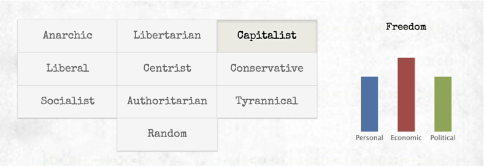
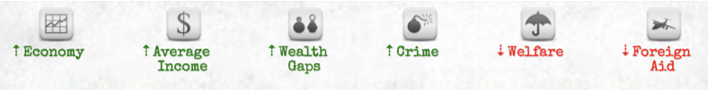
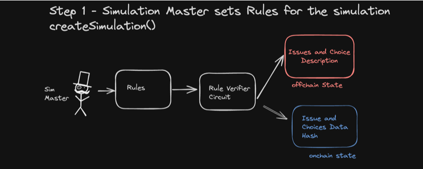
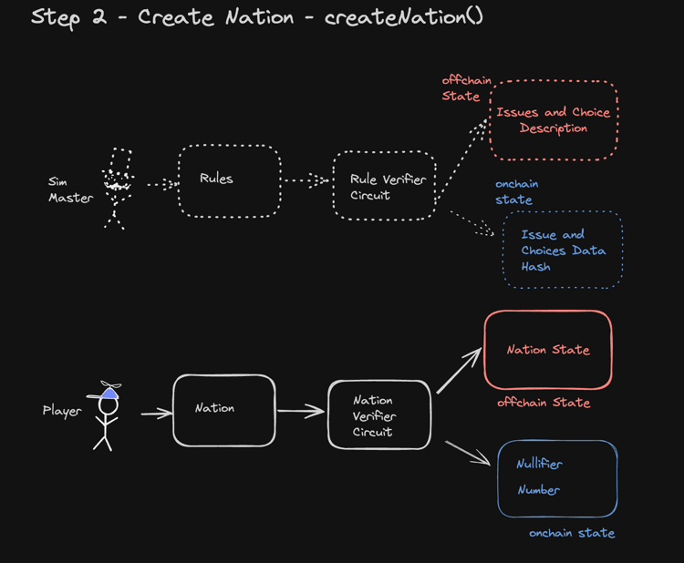
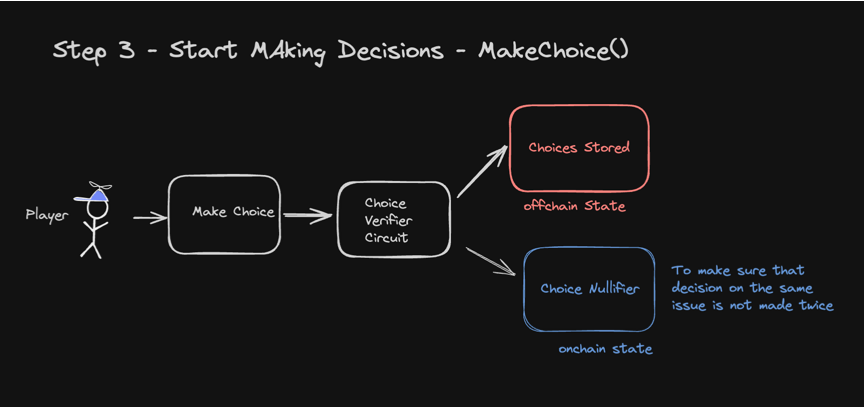
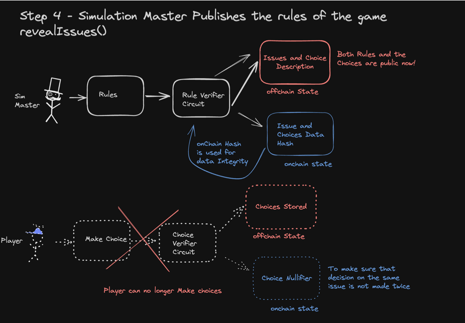

# MinaStates - Government Simulation Game

MinaStates is a nation-building simulation game where you can shape a country based on your political ideals. Nurture and protect your citizens, or choose to rule with an iron fist. The choice is yours. We use ZK(O1js) to verify that the rules of the simulation does not change midgame. 

Inspired by Max Barry's - https://www.nationstates.net/

How the simulation works: 

As you play the game, you have to make governmental decisions - from big to downright silly: 

Examples of Decisions and Choices: 

```
Issue: Should Democracy Be Compulsory?

Choices:
1. "Compulsory voting makes about as much sense as having the death penalty for attempted suicide," says a civil rights activist"You can't force people to be free! You can only give them the choice. 

2. "It's not contradictory at all," argues political commentator. "The fact is, if not everyone votes, the outcome isn't truly representative. Some groups--like elderly gun nuts--vote more often than others. That's why we always end up with such terrible politicians."

3. "This raises an interesting issue," says your brother. "And that is: why do we need elections, anyway? Seems to me it would be much simpler if you just decided what was right
```

Based on Choices Picked, Economic, Political and Personal Freedom gets affected. Every Choice has both positive effect and negative effect on various things


As you keep answering the questions, your country might become a dictatorship or a capitalist utopia! 

# Game Overview

## Step 1

First the game Simulation Initiated: 


Simulation is Initiated with a bunch of governmental issues and choices.

## Step 2 

A Player joins and created a nation



## Step 3 

Player Starts making Decisions for their Nation



## Step 4 
Simulation Master Makes all the Rules Public 



## Step 5 
Based on User Choices and Rules, the Nation's State is Calculated. 
Now teh country can be a dictatorship or Democratic utopia!

# On-Chain and Off-Chain States 

For this Project, I used On-Chain (limited to 8 Field) states, mainly to record game state, and merkle roots needed for maintaining the integrity of the simulation 

```
   /**
   * State variables. on-chain game state (max 8 fields)
   */
    @state(Field) numberOfNations = State<Field>(); // The number of nations in the simulation
    @state(Field) numberOfIssues = State<Field>(); // The number of issues in the simulation
    @state(Field) issuesRevealed = State<Field>(); // The number of issues revealed in the simulation, by the simulation master
    @state(Field) issuesHash = State<Field>(); // Issues hash stored on-chain, to check validity later
    @state(Field) simulationMaster = State<Field>(); // The player who created the simulation
    @state(Field) playerNullifierRoot = State<Field>(); // MerkleMap <playerAddress -> Field(0)|Field(1)>
    @state(Field) choiceNullifierRoot = State<Field>(); // MerkleMap <IssueId(Combination of Player, Issue) -> Field(0)|Field(1)>
    
    
    /** 
     * Off-chain states
     */

    // this state is used to store the off-chain state commitments internally
    @state(OffchainStateCommitments) offchainState = State(OffchainStateCommitments.empty());
```

Whereas Off-Chain state does the heavy lifting of holding the Nation state and the Issues History

```
const offchainState = OffchainState({
    nations: OffchainState.Map(PublicKey, Nation), // map is (playerAddress -> Nation)
    issueStatements: OffchainState.Map(Field, IssueStatement), // map is (issueId -> IssueStatement)
    issueConsequences: OffchainState.Map(Field, IssueConsequence), // map is (issueId -> IssueConsequence)
    nationChoices: OffchainState.Map(Field, Field),  // map is (choiceKey -> ChoiceId)
});
```

## Thoughts on Off-Chain State API

* It is a decent alternative to Protokit's Onchain Key, Value Storage on the Rollup 
* It is not very obvious from the docs on where the off-chain data is stored, is it Single Server solution ( I assumed so), more documentation on how to host it in Production environment would be useful
* It is not very Obvious from the docs if the connection off-chain state an the zkapp needs to happen in zkApp, or it is only useful during testing...

```
// connect contract to off-chain state
offchainState.setContractClass(SimulatorZkApp);
```

* The examples would be lot more legible if the code, and the testing were separated in two different files.
