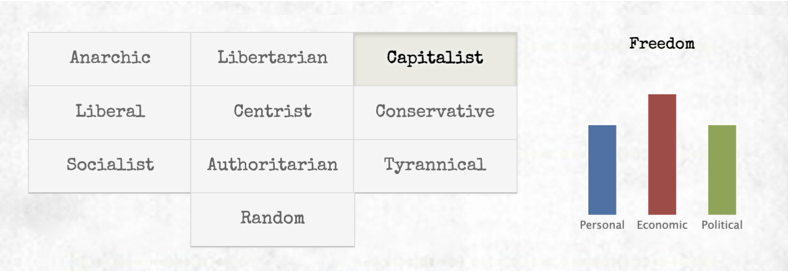
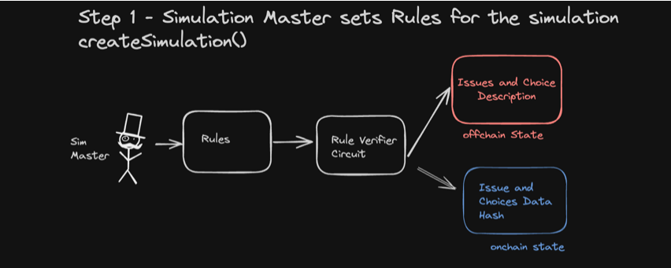
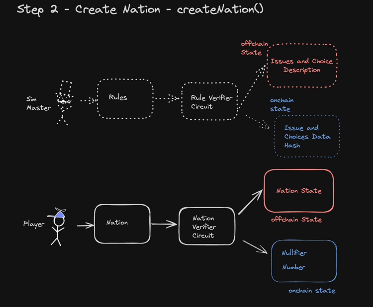

# MinaStates - Government Simulation Game

MinaStates is a nation-building simulation game where you can shape a country based on your political ideals. Nurture and protect your citizens, or choose to rule with an iron fist. The choice is yours. We use ZK(O1js) to verify that the rules of the simulation does not change midgame. 

Inspired by Max Barry's - https://www.nationstates.net/

How the simulation works: 

As you play the game, you have to make governmental decisions - from big to downright silly: 

Examples of Decisions and Choices: 

```
Issue: Should Democracy Be Compulsory?

Choices:
1. "Compulsory voting makes about as much sense as having the death penalty for attempted suicide," says a civil rights activist"You can't force people to be free! You can only give them the choice. 

2. "It's not contradictory at all," argues political commentator. "The fact is, if not everyone votes, the outcome isn't truly representative. Some groups--like elderly gun nuts--vote more often than others. That's why we always end up with such terrible politicians."

3. "This raises an interesting issue," says your brother. "And that is: why do we need elections, anyway? Seems to me it would be much simpler if you just decided what was right
```

Based on Choices Picked, Economic, Political and Personal Freedom gets affected. Every Choice has both positive effect and negative effect on various things


As you keep answering the questions, your country might become a dictatorship or a capitalist utopia! 

# Game Overview

## Step 1

First the game Simulation Initiated: 


Simulation is Initiated with a bunch of governmental issues and choices.

## Step 2 

A Player joins and created a nation



## Step 3 
